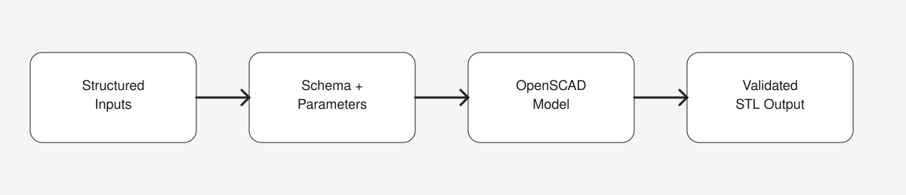
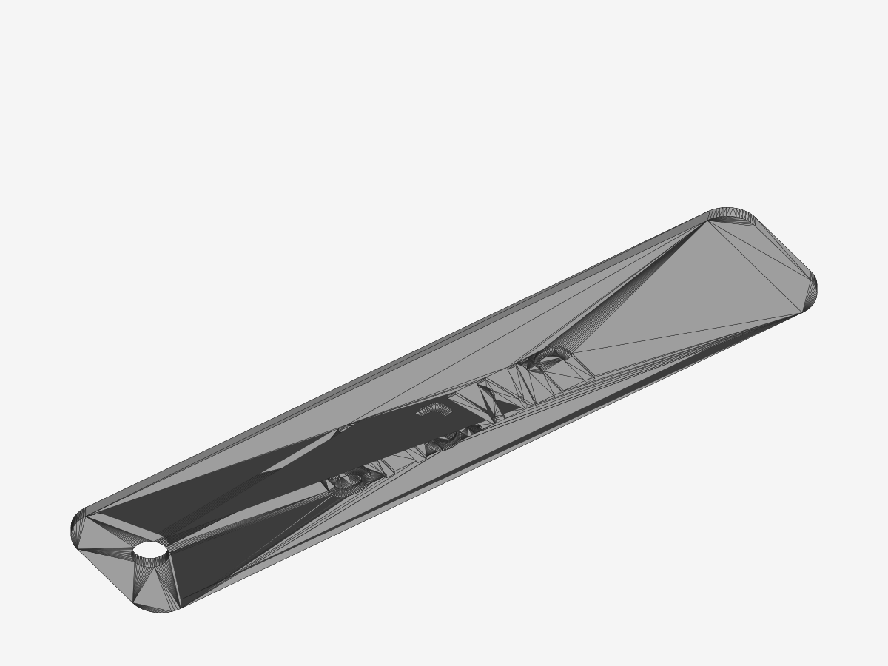

# PromptToSTL

Generate 3D-printable STL files from structured prompts and parametric templates.

PromptToSTL is a local, template-driven tool that turns structured inputs into deterministic OpenSCAD models and exportable STL files. It is designed for reproducible 3D printing workflows with optional AI-assisted prompt routing.



## What It Does
- Converts structured inputs into parametric 3D models
- Uses OpenSCAD templates for deterministic geometry
- Supports repeatable STL generation with validation
- Runs locally (no cloud dependency for geometry)
- Optional AI-assisted prompt routing for faster setup

## Example Output


## Quickstart
### Requirements
- Python 3.10+
- OpenSCAD (CLI accessible)

### Install
```bash
python3 -m venv .venv
source .venv/bin/activate
pip install -r requirements.txt
```

### Optional: AI Prompt Routing
Create a `.env` file with your API key to enable the "Describe it" mode:
```bash
OPENAI_API_KEY=your_key_here
```

### Run
```bash
streamlit run app.py
```
Open http://localhost:8501 in your browser.

## Current Templates
- Keychain (rounded rectangle)
- Coaster (round)
- Nameplate (multiline text layout)

## Project Structure
```plaintext
app.py              # Streamlit UI
src/                # Core logic (routing, layout, validation)
templates/          # OpenSCAD templates + JSON schemas
assets/             # Screenshots and diagrams for README
out/                # Generated builds (gitignored)
```

## Notes
- Geometry is always produced by OpenSCAD for deterministic, printable output.
- The "Describe it" mode uses OpenAI via LangChain; manual mode works offline.

## Roadmap (Short)
- More templates (plaques, badges)
- Better layout constraints and text overflow handling
- SVG logo overlays and embossing improvements

## License
MIT
